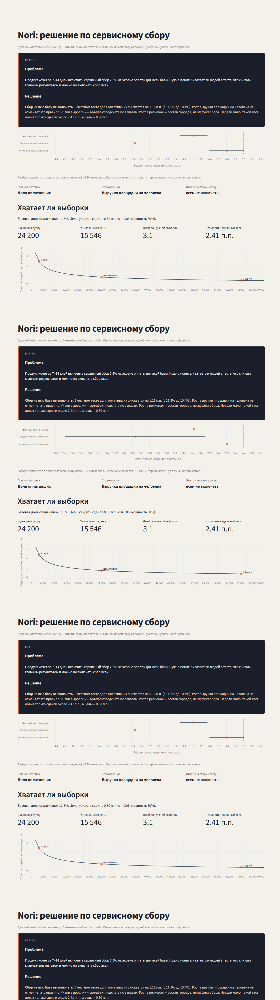

# Nori: решение по сервисному сбору на оплату



## Проблема

Маркетплейс Nori хочет за 7–14 дней включить сервисный сбор 2.5% на экране оплаты для всей базы. Команда продукта смотрит короткий пилот и просит ответ: включать всем или нет.

Риск в том, что сбор может снизить долю людей, которые доходят до оплаты. Выручка площадки на человека при этом может вырасти просто потому, что сверху берётся 2.5%. Если смотреть только средний заказ среди тех, кто уже заплатил, или сравнивать крупные города с остальными, легко принять рост денег за успех сбора.

Нужно заранее договориться, что главное — доля оплативших, деньги площадки — страховка, а «чеки» и оборот по заказам сами по себе решение не принимают. И отдельно проверить, хватает ли людей в тесте, чтобы заметить сдвиг около 0.80 пункта.

Данные синтетические. Служебная таблица истинного эффекта в оценках не используется.

## Решение

Смотрим четыре постановки на одних и тех же правилах.

1. Честный тест: людей случайно делят пополам на 14 дней. Решение — по доле оплативших.
2. Те же группы, другой счёт денег: средний заказ только среди купивших против оборота на человека, включая тех, кто ушёл без оплаты.
3. Сбор включили в крупных городах, без случайного деления. Наивный рост сравниваем с оплатами после поправки на недели до сбора.
4. Неделя на малой доле базы: проверяем, видит ли такой тест целевой сдвиг 0.80 пункта.

На честной 14-дневной выборке доля оплативших снижается с 11.55% до 10.38% (−1.16 пункта). Выручка площадки на человека растёт на 18.9% — это не отменяет вывод по оплатам. «Средний заказ +9.1%» появляется только если выкинуть некупивших; оборот на человека не растёт. Рост в регионах — состав городов плюс сбор, не доказательство, что сбор можно включать всем. Недели мало: тест замечает сдвиги от 2.41 пункта, цель была 0.80.

## Вывод

**Сбор на всю базу не включать.**

Честный тест по главной метрике не проходит. Рост денег площадки и «выросшие чеки» не подменяют долю оплативших. Гео-пилот нельзя читать как случайный A/B: если случайно делить людей нельзя, оставляют 10% без сбора или включают регионы по очереди. Короткое окно не закрывает целевой сдвиг — его продлевают, а не включают всем.

Интерактивный отчёт: `streamlit run app/streamlit_app.py` после сборки базы.

## Как запустить

```powershell
python -m pip install -r requirements.txt
python -m src.generate
python -m src.analyze
streamlit run app/streamlit_app.py
```

Файл `data/nori.db` собирается локально и в git не входит.

## Стек и склад

Python, pandas, NumPy, SciPy, SQLite, SQL-витрины, Streamlit.

| Таблица | Назначение |
|---|---|
| `users`, `regions` | Пользователь и регион |
| `experiments`, `assignments` | Тест и вариант |
| `sessions`, `events`, `orders` | Воронка и деньги |
| `exposed_users`, `daily_traffic` | Экспозиция и дневной трафик |
| `experiment_truth` | Истинный эффект, только генератор и подвал отчёта |

Витрины: [`sql/mart_user_experiment_metrics.sql`](sql/mart_user_experiment_metrics.sql), [`sql/mart_sample_size.sql`](sql/mart_sample_size.sql), [`sql/mart_srm.sql`](sql/mart_srm.sql), [`sql/mart_cuped_geo.sql`](sql/mart_cuped_geo.sql), [`sql/mart_order_gmv.sql`](sql/mart_order_gmv.sql).
